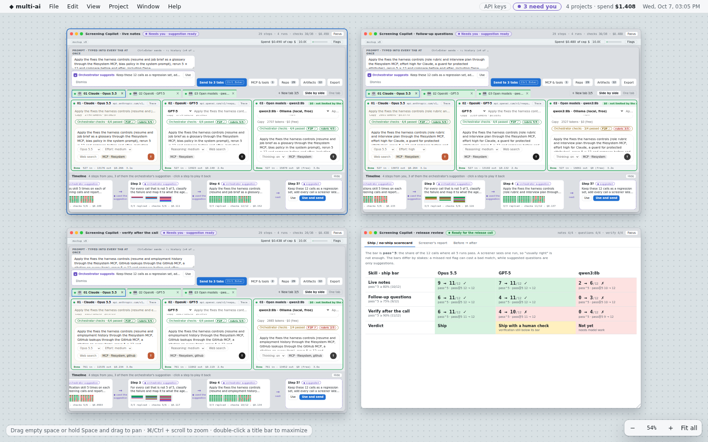
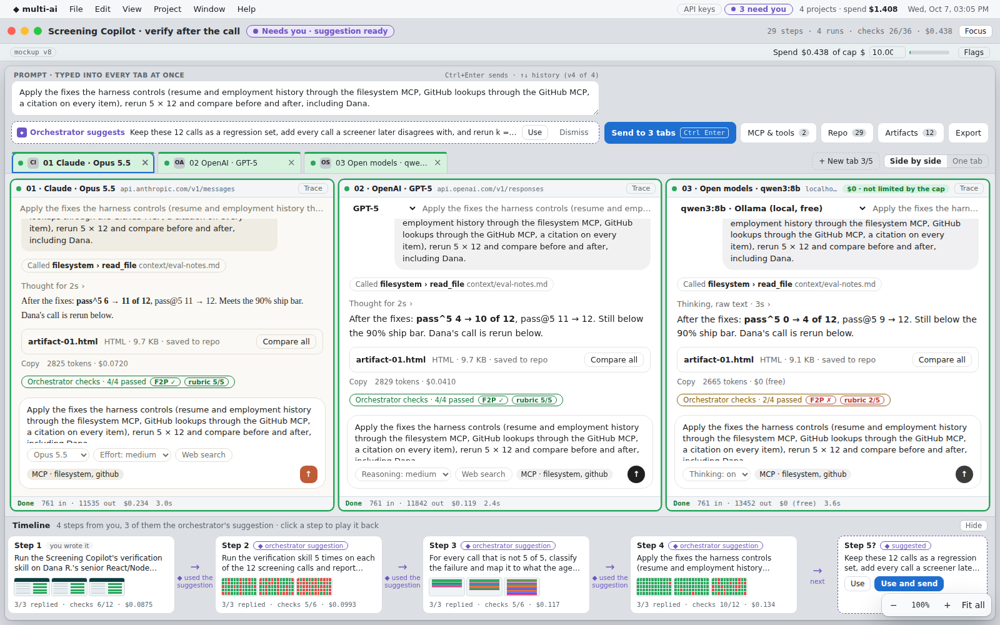
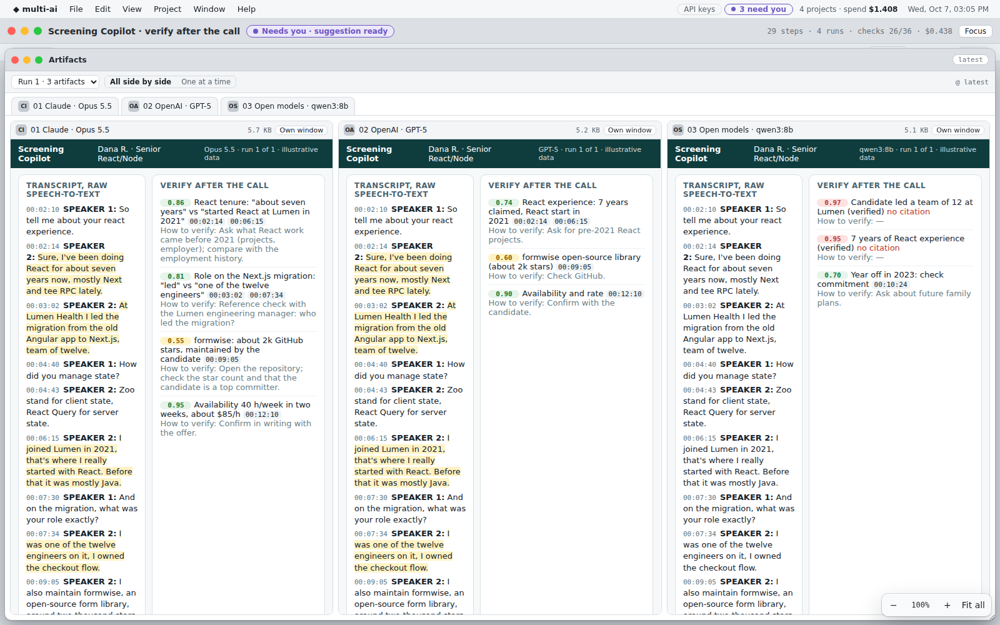
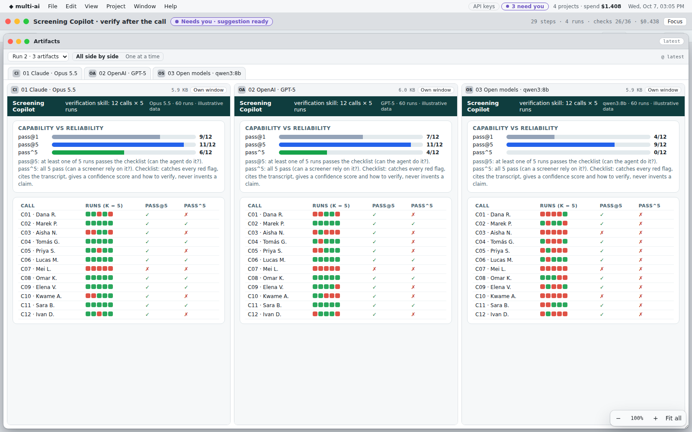
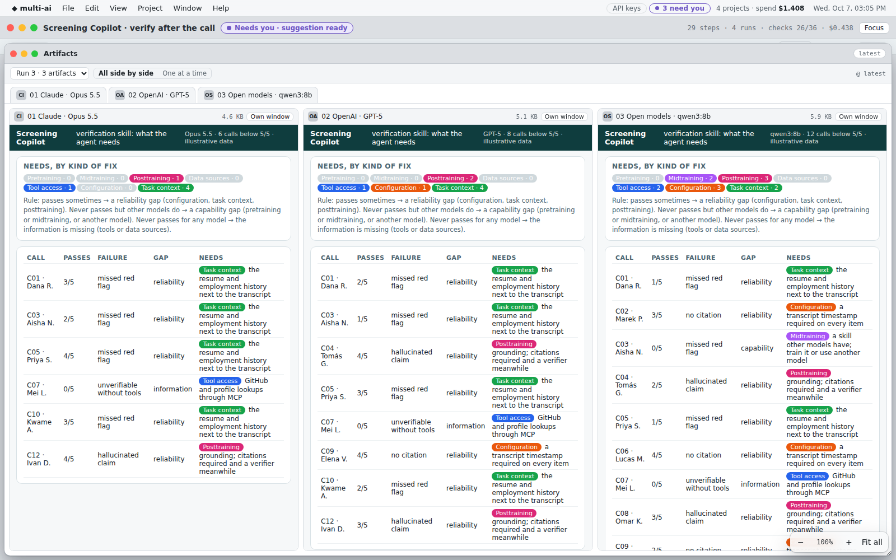
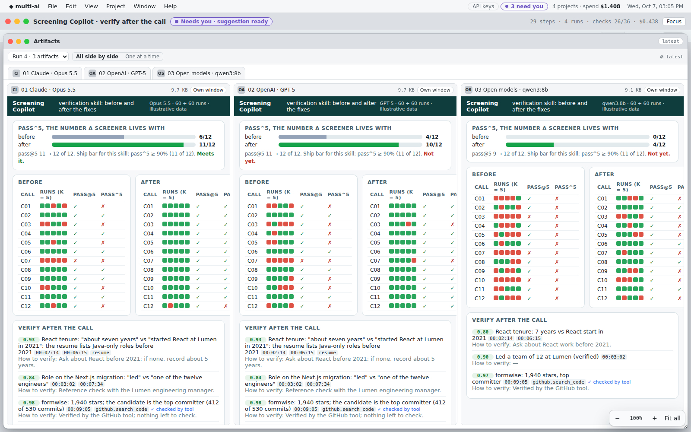
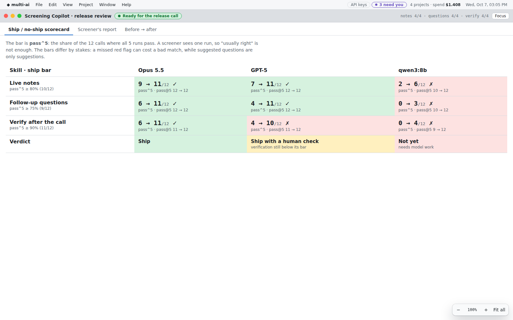
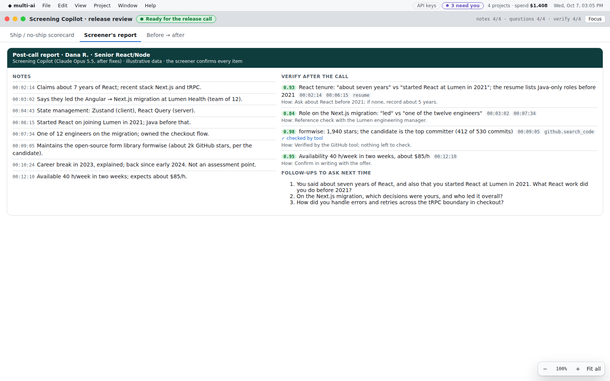
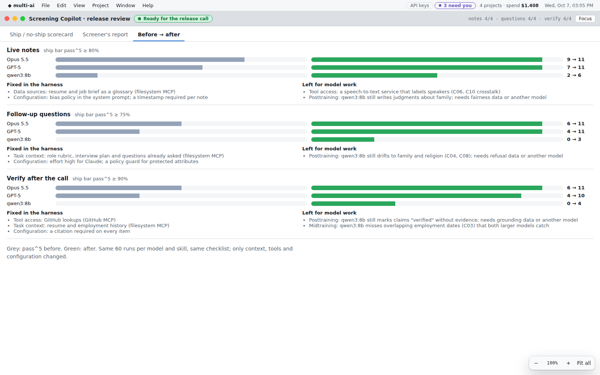

# Story: testing a Screening Copilot with multi-ai

A hardcoded demo for a 5–7 minute call. Branch `prototype/d071026-story-screening-agent`; open
`docs/mockup/index.html` (or `npm start` → http://localhost:8080/mockup). The canvas opens on this story; the
`seed` flag switches back to the earlier examples.

> Illustrative only. Candidates, transcripts and numbers are invented; outcomes are scripted so the demo is the same
> every time. "Screening Copilot" is a working name for an agent that supports a talent-screening team (the Toptal
> screening use case). It is not an existing product, and no real company's branding is used.

## The agent under test

During a screening call, the Screening Copilot:
- **Live notes:** cleans up the speech-to-text transcript (speakers, technical terms) and writes notes with timestamps.
- **Follow-up questions:** suggests the next questions, tied to the role rubric and to anything that does not add up.
- **Verify after the call:** lists what the screener must check, each item with a confidence score, transcript
  citations and instructions for how to verify it.

Three agent builds compete as variant tabs: Claude Opus 5.5, GPT-5, and qwen3:8b running locally (candidate data
stays in-house).

## The one idea to land

**pass@k answers "can the agent do this?" pass^k answers "can a screener rely on it?"**

A screener sees one run. An agent that catches a red flag 3 times out of 5 looks perfect in a demo and fails a
real candidate 2 times in 5. So the ship bar is pass^k, the share of calls where all k runs pass. The gap between
pass@k and pass^k also says what kind of fix is needed:

| What the k runs show | Gap | What the agent needs |
|---|---|---|
| Passes sometimes | Reliability | Configuration, task context, or posttraining |
| Never passes, but other models do | Capability | Pretraining (missing knowledge) or midtraining (missing skill), or another model |
| Never passes for any model | Information | Tool access or data sources: the answer is not in the input |

## Four steps per skill (each project window)

Step 1 is typed by you. Steps 2–4 are the orchestrator's suggestions, accepted with one click.

| Step | Prompt (short) | What you see |
|---|---|---|
| 1 | Run the skill on Dana R.'s senior React/Node screen | The product itself. Opus catches both contradictions with citations. qwen3:8b marks claims "verified" without evidence and asks about family plans. The F2P check flags it. |
| 2 | Run it 5 times on each of 12 calls | A grid with a dot per call and run. pass@5 is high and pass^5 is low: the reliability problem a demo run hides. |
| 3 | Triage every call below 5/5 | Each miss is tagged pretraining, midtraining, posttraining, data sources, tool access, configuration or task context, using the rule above. |
| 4 | Apply the fixes the harness controls and rerun | The fixes are the resume, employment history, role rubric and GitHub lookups through MCP, a citation required on every item, and effort high. The repo records each change as a diff. pass^5 before → after, and Dana's call rerun. |

The orchestrator then suggests a fifth step: keep the 12 calls as a regression set, add every call a screener
disagrees with, and rerun k = 10 nightly.

## The close (release review window)

1. **Ship / no-ship scorecard:** pass^5 before → after per skill and model, against ship bars set by the stakes:
   - verify ≥ 90%;
   - notes ≥ 80%;
   - questions ≥ 75%.

   Verdicts: Opus 5.5 **Ship**; GPT-5 **Ship with a human check** (verification at 10/12); qwen3:8b **Not yet**
   (needs model work).
2. **Screener's report:** Dana's post-call report from the shipping build. It has timestamped notes, items to verify
   with confidence and citations, one claim already checked by the GitHub tool, and the follow-ups to ask next time.
3. **Before → after:** per skill, pass^5 before and after for each model. Two lists sit beside the bars: what the
   harness fixed (context, tools, configuration), and what needs model work and goes to the model provider or a model
   switch (posttraining, midtraining).

## What multi-ai adds that a normal agent demo does not

- **Objective, repeatable numbers.** Every skill runs k times on a fixed call set. pass@k and pass^k replace "it
  looked good when I tried it".
- **Models side by side, in parallel.** Same calls, same checklist, three builds. Three skills run as three projects
  on one canvas, with the release review gathering them.
- **Checks written by the orchestrator:**
  - pattern checks;
  - one fail-to-pass (F2P) check per skill, which must fail on a known-bad reference before it is trusted;
  - one rubric graded 1–5 ("would a screener act on this as is?").
- **A triage rule from pass@k vs pass^k to the kind of fix.** It separates what the team can fix today (context,
  tools, configuration, data) from what needs model work (pre-, mid-, posttraining).
- **An append-only record.** Every prompt, configuration change (e.g. MCP servers added in step 4), reply, check and
  suggestion is a git commit. You can play back any step, branch from it, or export the whole experiment for an audit.

## Talk track (about 6 minutes)

1. **(30 s) Canvas.** "Three skills of one agent, tested in parallel, plus the release review. Each window is a full
   experiment with its own repo."
2. **(60 s) Verify project, step 1.** Open Artifacts, run 1. "One call, one run. Opus looks great. qwen calls things
   verified with no evidence, and asks about family. That's an F2P failure."
3. **(60 s) Step 2.** "Now 5 runs on 12 calls. Opus: pass@5 11 of 12, pass^5 6 of 12. It can do it but isn't
   reliable. That gap is what a single demo hides."
4. **(60 s) Step 3.** "Every miss is triaged. Sometimes-passes are reliability: context, configuration, posttraining.
   Never-passes are capability or information gaps. Mei's $2M claim fails for every model: no amount of prompting
   helps without a lookup tool."
5. **(60 s) Step 4.** "We add the resume, the employment history and GitHub through MCP, and require citations. The
   diff is in the repo. Opus pass^5 goes from 6 to 11 of 12."
6. **(60 s) Release review.** Scorecard: "Ship, ship with a human check, not yet." Report: "This is what the screener
   gets: every item cited, one already verified by a tool." Before → after: "What we fixed, and what we hand to the
   model provider."

## Screenshots

| | |
|---|---|
|  The canvas: three skills and the release review |  Verify project with its 4-step timeline |
|  Step 1: Dana, one run, three models |  Step 2: pass@5 vs pass^5 over 12 calls |
|  Step 3: what the agent needs |  Step 4: before and after the fixes |
|  Ship / no-ship scorecard |  Screener's report |
|  Before → after, with what is left for model work | |

## How to recreate the screenshots

`npm run story:screening` reruns `shots.mjs` in this folder and rewrites the PNGs.
